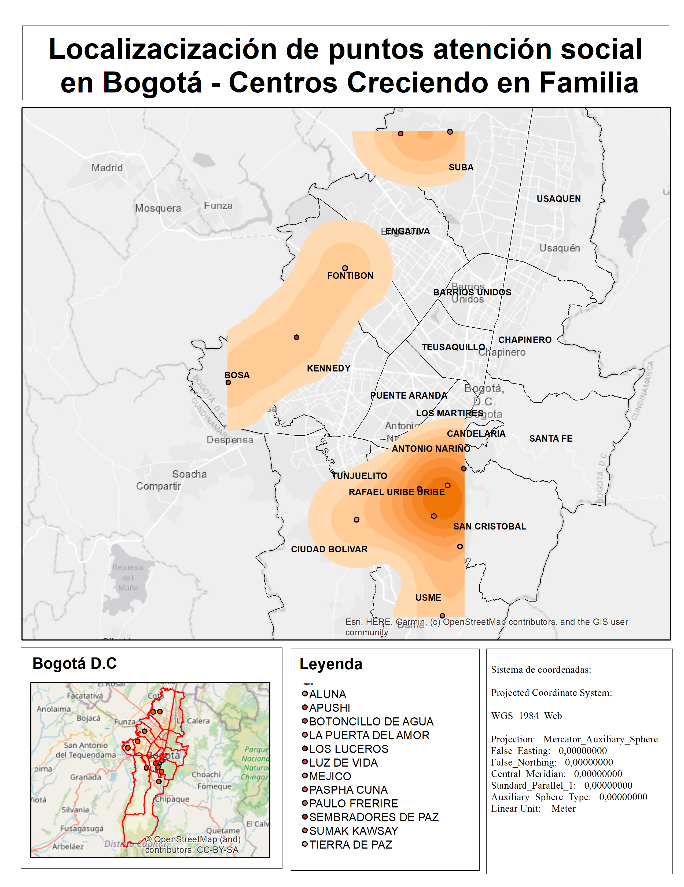
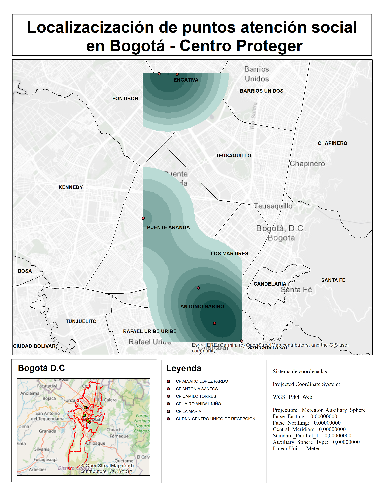
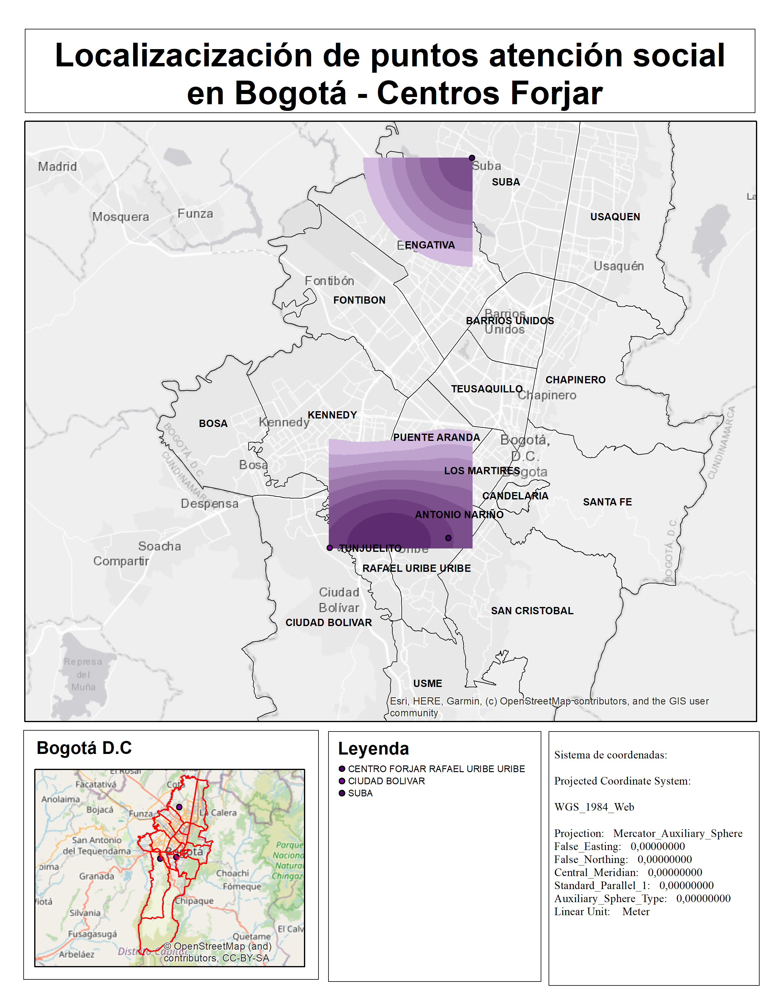
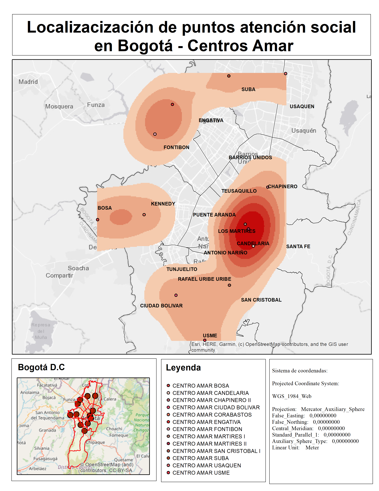
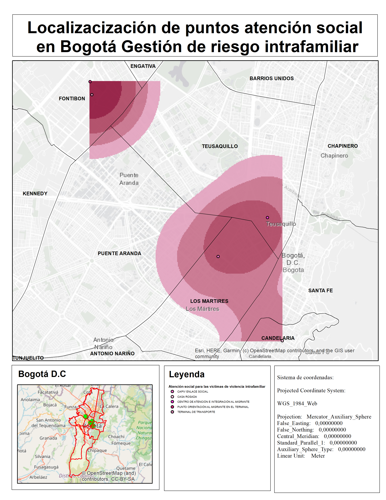
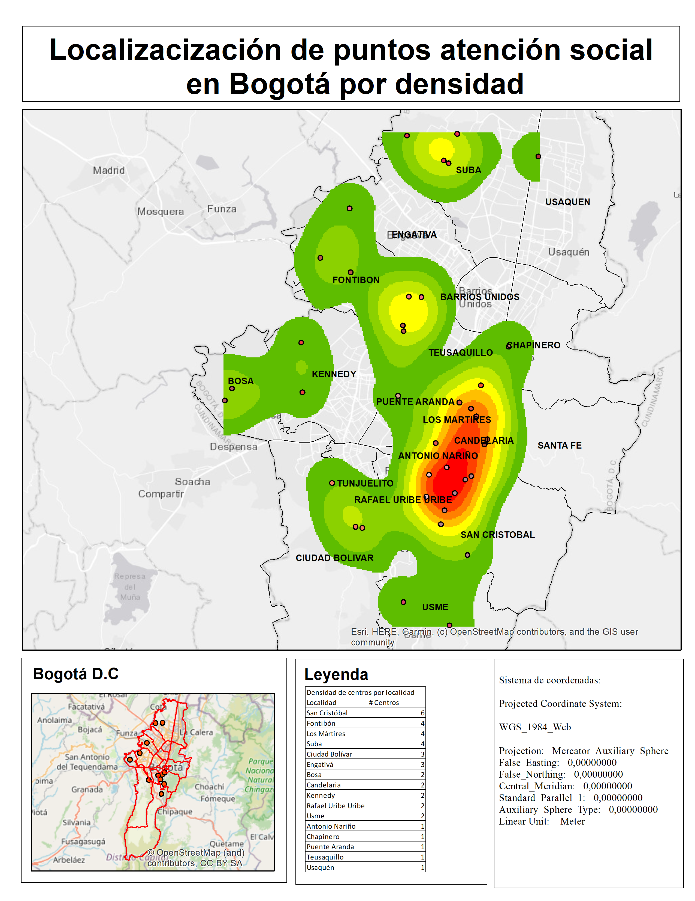

# Bogotá y la inclusión social. 

## 1.	¿Cuál es el problema a tratar?

Bogotá es la ciudad de Colombia que más población acoge en todo el país, por diferentes razones, entre ellas, la principal es que, al ser la capital es el lugar donde más confluyen dinámicas económicas y por ende si se realiza una discriminación de aporte de puntos al PIB por región, Bogotá lleva la delantera; se estima con cifras que el PIB total del país a 2018 ascendía a 985.931, de los cuales 252.511 provenían de la ciudad. *Medido en miles de pesos. 
Así mismo, al ser una ciudad con una dinámica voraz, necesita políticas eficientes para todos sus habitantes, de los cuales el 5,9% corresponde a población en situación de pobreza extrema; y el 12.4% se encuentra en índices de pobreza tasable pero no con índices de NBI apropiados. Esto, llevado a porcentajes, en suma, indica que el 18,3% de la población en Bogotá requiere atención social permanentemente. 

La Alcaldía, consciente de la situación de la población en mención ha puesto en marcha una serie de programas inclusivos que trabajan con población en situación de vulnerabilidad; sin embargo, para un ciudadano que recorra la cuidad a diario parecería no ser suficiente porque constantemente se evidencian las mismas situaciones; esto, se debe más a falta de socialización con los programas existentes y al conocimiento de cada uno, es decir a la masificación de la difusión de información. 

## 2.	¿Por qué los datos geográficos ayudan a resolverlo?

Pareciera casi un dogma que los estratos sociales menos favorecidos son los que más atención social requieren; por tanto, se debería realizar un análisis proporcional a la cantidad de infraestructura disponible para la atención de eventos por zona en función del estrato; además de la cercanía entre un punto de atención y el otro para determinar qué tan útil resulta esto y cuáles zonas quedan desatendidas por la lejanía de centros de atención. 

## 3.	Descripción de la solución propuesta.

La solución que se plantea es recopilar los datos disponibles en el repositorio del DPS, cruzarlos con los estratos socioeconómicos y validar cuáles localidades deben recibir atención de infraestructura, además de la concentración de sitios de atención por localidad. Posteriormente se plantea validar con una capa de uso del suelo cuáles podrían ser las potenciales ubicaciones sobre las cuales el DPS podría poner la mira para realizar adquisiciones inteligentes de predios en función del uso que le sirve a dichos centros. (Dotacional), esto para realizar un primer acercamiento sobre ubicaciones estratégicas de las zonas de atención. 

## 4.	Listado detallado de las fuentes de datos seleccionadas. Mínimo 3 conjuntos de datos. Incluir información del proveedor de los datos, enlace para descarga, título y descripción del conjunto de datos, descripción de los atributos principales a utilizar.

Atributibamente hablando los conjuntos de datos tienen el mismo estándar, están confgurados para mostrar horarios de atención, dirección, teléfono, localización y sector catastral en el que se encuentra. 

La fuente de datos proviene de IDECA, a continuación se lista la fuente de datos y se enuncia el enlace donde se encuentra disponible. 

| Insumo       | Descripción          | Fuente  |
| -------------|:-------------:| -----:  |
| Manzanas Bogotá| Conoce las unidades geográficas tipo manzana las cuales se les asocia la variable de estrato socioeconómico, siendo esta, la clasificación de los inmuebles residenciales que deben recibir servicios públicos. Se realiza principalmente para cobrar de manera diferencial por estratos los servicios públicos domiciliarios, permitiendo asignar subsidios y cobrar contribuciones. | https://www.ideca.gov.co/recursos/mapas/      
| Centros Proteger | Espacio donde se brinda atención integral para la garantía de derechos de niños, niñas, adolescentes en edades comprendidas entre 0 a 9 años 11 meses y hermanos con edad hasta 10 años 11 meses cuyos derechos se encuentran inobsevardos, amenazados o vulnerados, en espacios que garantizan la protección y ambientes propicios para llevar a cabo procesos de restablecimiento de derechos a niños, niñas y adolescentes los cuales buscan reparar el daño causado y crear contextos que posibiliten la construcción de individuos integrales para el efectivo goce de sus derechos.     |  https://www.ideca.gov.co/recursos/mapas/centro-proteger-bogota-dc   |
| Centros Creciendo en Familia| Espacio donde se presta servicio de atención integral a mujeres gestantes, niñas y niños menores de dos años de edad en el marco de la Ruta Integral de Atenciones a la Primera Infancia -RIA- que promueve el desarrollo infantil desde el fortalecimiento de las capacidades para educar, cuidar y proteger de madres, padres, cuidadores y agentes comunitarios en los entornos hogar y espacio público.   |    https://www.ideca.gov.co/recursos/mapas/creciendo-en-familia-bogota-dc |
| Centros Amar| Espacio donde se presta servicio de atención integral con enfoque diferencial a niñas, niños y adolescentes en riesgo o en situación de Trabajo Infantil ampliado y sus familias, para fortalecer y contribuir a su desarrollo integral, garantía y restablecimiento de sus derechos, a través de actividades pedagógicas, cuidado calificado, apoyo alimentario con calidad y oportunidad y promoción de la corresponsabilidad de las familias en entorno social.     |   https://www.ideca.gov.co/recursos/mapas/centro-amar-bogota-dc  |
| Centros Forjar | Espacio donde se presta servicio especializado de atención integral con enfoque de derechos diferencial a los adolescentes y jóvenes mayores de 14 años vinculados al sistema de Responsabilidad Penal para Adolescentes (SRPA) sancionados con Prestación de Servicios a la Comunidad y Libertad Asistida/ Vigilada y el apoyo para la Administración de Justicia en el Proceso Administrativo de Restablecimiento de Derechos - PARD, a través de la implementación de una propuesta educativa, protectora y restaurativa cuyo propósito es la garantía y restablecimiento de sus derechos y promociona la corresponsabilidad de las familias.    |   https://www.ideca.gov.co/recursos/mapas/centro-forjar-bogota-dc    |
| Atención social Víctimas de violencia intrafamiliar | Servicio en el que se busca la adecuada, oportuna, eficaz garantía, protección y restablecimiento de los derechos de las personas involucradas en conductas atentatorias de la Armonía y la Unidad Familiar.   |    https://www.ideca.gov.co/recursos/mapas/atencion-victimas-violencia-intrafamiliar-cavif-bogota-dc  |
| Localidades Bogotá | División del territorio Distrital, teniendo en cuenta las características sociales de sus habitantes y de acuerdo al reparto de competencias y funciones administrativas asignadas por el Concejo Distrital.    |    https://www.ideca.gov.co/recursos/mapas/localidad-bogota-dc

*Descripciones tomadas de conjunto de Datos IDECA 

## 5.	Descripción detallada del procesamiento no trivial realizado a los datos (algoritmos, herramientas utilizadas, modelos, etc)
 
Lo primero que se realizó fue un clip a los estratos que no cumplían con el objeto de estudio. 

 

Posteriormente se realizó una selección de localidades por intersección con manzanas objeto de estudio. 

 

Se procede a realizar una densidad de tipo kernel con los datos en cuestión como se muestra a continuación: 

 

 
  

Finalmente se generan mapas de clústeres sobre los que se puede evidenciar si la población o no está siendo atendida como sigue: 

Finalmente se realizó una validación de los puntos que eran objeto de la zona de estudio y su distribución espacial por la ciudad. 

Se pudo evidenciar que no se suplen las necesidades donde deberían ser atendidas en principio. 

 

## 6.	Descripción detallada de la metodología utilizada para generar los mapas (atributos seleccionadas, métodos de clasificación, colores, etc)

Se realizó inicialmente una depuración de los estratos con un clip, en donde se seleccionaron los estratos 1 y 2 como foco de trabajo. 
Posteriormente se seleccionaron los centros de atención que realizan trabajo social sobre la población y se generó una densidad de tipo kernel para saber cuáles de esas poblaciones están desatendidas, y se realiza el mismo procedimiento con cada centro de atención. 
Después de tener identificados los clústeres de trabajo, se cruza la información con un overlap sobre las manzanas objeto de estudio. 
Finalmente se utiliza una capa que contiene todos los centros de atención y se realiza el mismo análisis de clúster para validar la misma variable en conjunto sobre la ciudad

## 7.	Descripción detallada del procedimiento técnico utilizado para generar los mapas (plugins, extensiones, procesos, transformaciones de datos, etc). Ejemplos de herramientas: Qgiscloud , leaflet, QGIS2Web , Github Pages, kepler.gl, flourish, etc.
Se utilizaron varias herramientas, utilicé en un principio QGIS2web para la publicación de los puntos de atención; utilicé además GitHub para la realización de cargue de datos y Colorbrewer para la asociación de la gama de colores idónea para la realización de las salidas gráficas.

https://stackoverflow.com/questions/14675913/changing-image-size-in-markdown/21972032#21972032

## 8.	Adicionar al repositorio github los archivos generados (ejm. html) en la subcarpeta Tarea_1/html/

https://github.com/caduci15/clase_carto1/tree/master/Tarea_1/html

## 9.	Urls de los mapas publicados en la web

## 10.	Conclusiones Ventajas / desventajas / dificultades encontradas durante el desarrollo del ejercicio

##Conclusiones: 

Con los datos empleados surgen una considerable serie de preguntas sobre los focos sobre los que se centra la atención del DPS, no están encaminados en absoluto a donde deberían ir, por lo que debería repensarse si realmente se están focalizando las ayudas hacia donde debería ser. 

Con los datos en general: todos, el foco inicial del ejercicio era usar los datos contenidos en https://www.datos.gov.co/, donde al filtrar por campos con geometrías, existían una cantidad considerable, pero al intentar llevarlos a algún formato útil para el ejercicio (como por ejemplo un Json, GeojSon, SHP, incluso un CSV y hacerle una posterior geocodificación), no fue posible. Una buena cantidad de datos ahí suministrados no tienen la completitud necesaria para ser utilizados. 

Con las herramientas, surgen varios interrogantes, el primero es el tamaño máximo que permite cargar QGIS2Web, se intentó realizar un cargue de las manzanas objeto de estudio, y aunque se atendió la premisa de clase de tamaño, no permitió por superar la cantidad de unidades posibles para analizar. 

Se entiende de antemano que Qgis2web no es funcional para datos ráster, para ello se pensó usar Geoserver pero los tiempos no se ajustaron a dicha solución para poder mostrar los resultados del estudio. 
Con el cargue de imágenes, del mismo modo, hubo inconvenientes, no logré identificar cuál era el criterio para permitir el cargue de unas sí y otras no, al hacerle una inspección a los elementos por la página web, dice que no se encuentran cargados, pero al validar la existencia de los mismos en el repositorio de GitHub, está, por lo que no entendí nunca qué fue lo qye sucedió. 

